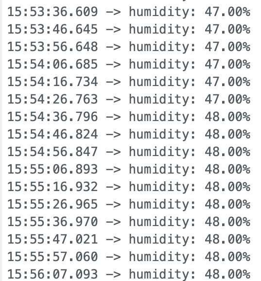
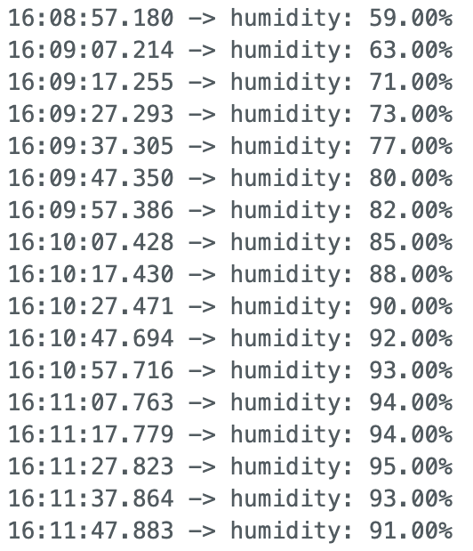
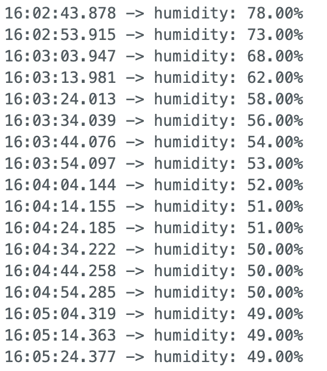
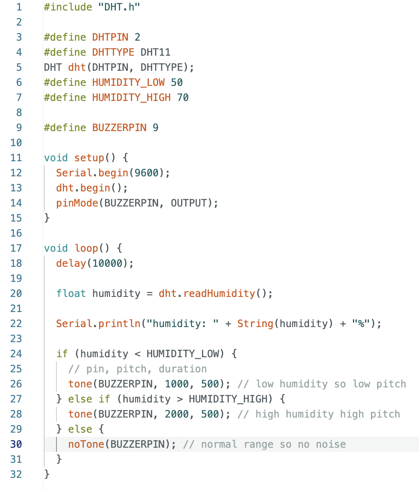
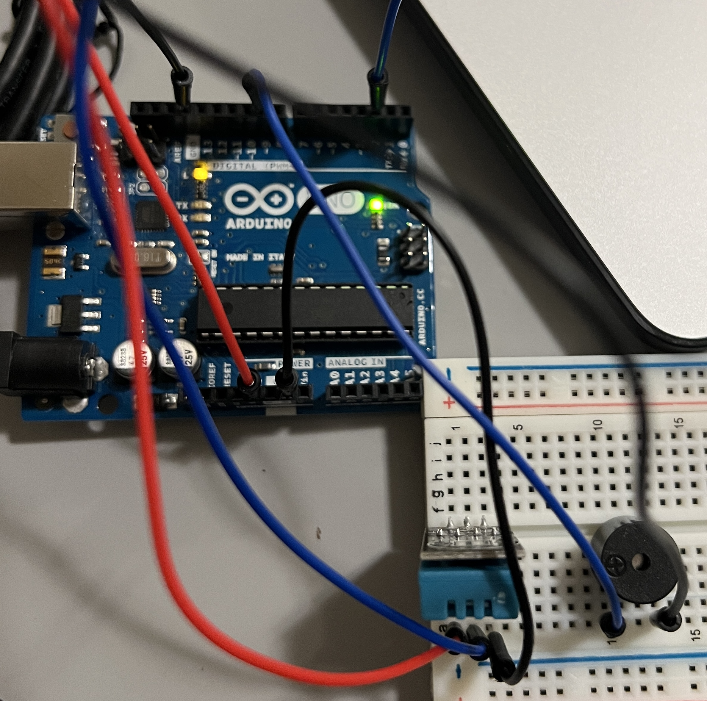

# Midterm

For the midterm, I used a DHT 11 to measure humidity at home. I chose to measure this because the humdity in my home and dorm can make it difficult for me to breathe at night and can ruin sleep quality. When this happens, I likely breathe through my mouth at night. This can make you feel tired in the morning (and causes many other health issues), so that's why I chose to use audio for the output. That could wake me up and give me the chance to lower the heater, ideally resulting in humidity levels increasing. Waking up in the middle of the night isn't ideal, but I would rather have that and then be able to breathe properly for the rest of the night than mouth breathe the whole time and not know until it's too late. I could have used a device long long ago. Low humidity is my main concern, but just to add a liiittle bit more to this project, I'm also looking out for high levels of humidity. 

### Data

To start off, I measured the humidity of my room with the heater on at the temperature I typically leave it on at night, which came out to be around 47%. This is low enough to make breathing more difficult at night. Of course, I could just not turn on the heater, which I don't anymore after realizing that caused problems for me. But this is for the midterm, okay? 

Below is the humidity measurements increasing as I brought my device into a steamy room (the bathroom with the shower on). It started from 48% humidity and made it's way to 95%. I took it out the bathroom after reaching 95% in order to avoid damaging anything.

Below is the humidity dropping after exiting the bathroom.

It was interesting to see how it took time for the humidity to increase and decrease to a room's humidity level, rather than just jumping to that value immediately. When leaving the steamy room, I though the humidity value might go down to around 50% quickly, but it took time since the DHT 11 appears to trap humidity inside, resulting in the measurements decreasing at the rate they did.

### Input
- Humdidity (measured every 10 seconds)

### Triggering Logic
- Low and high humidity measurements (below 50% and above 70%)

### Output
- Sound from a speaker (low pitch for low humidity, and high pitch for high humidity)

### Care Log
- The jumper wires can come out easily, so moving the device around must be done carefully
- The breadboard must be kept close to the Arduino due to the length of the wires, and since together they make up the device
- High humidity for extended perids of time can damage parts such as the breadboard. Nothing got damaged, but if I were to keep this in a place like a sauna, I heard that conformal coatings can be of use

